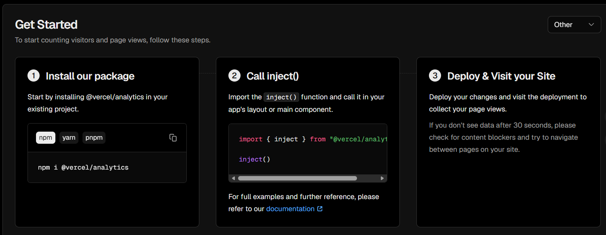

# 介绍的统计种类
1. 不蒜子
2. vercel
3. 百度分析
4. cloudflare分析
---
## 不蒜子
### 制作方法
- 不蒜子统计是一个免费的站点统计服务
- 官网:[busuanzi](https://www.busuanzi.cc/)
- 调用:通过CDN加载js脚本
- 样式:官方给了示例，直接改里面的id选择器的样式即可
> 关于CDN：

> CDN指的是将你存储在世界某地的服务器里的源码分发缓存在世界各地的其他服务器，这样在其他地方获取你的资源时只需要从最近的服务器调用即可
> 用多地缓存的方式来应对挂载的服务器距离目标用户太远的问题
### 示例代码
```html
<!DOCTYPE html>
<html lang="en">
<head>
    <meta charset="UTF-8">
    <meta name="viewport" content="width=device-width, initial-scale=1.0">
    <title>busuanzi</title>
    <style>
        .busuanzi_container {
            display: flex;
            flex-direction: column;
            align-items: center;
            justify-content: center;
        }
    </style>
</head>
<body>
    <div class="busuanzi_container">
        <span>今日总访问量 <span id="busuanzi_today_pv">加载中...</span> 次</span>
        <span>今日总访客数 <span id="busuanzi_today_uv">加载中...</span> 人</span>
        <span>本站总访问量 <span id="busuanzi_site_pv">加载中...</span> 次</span>
        <span>本站总访客数 <span id="busuanzi_site_uv">加载中...</span> 人</span>
        <span>本页总阅读量 <span id="busuanzi_page_pv">加载中...</span> 次</span>
        <span>本页总访客数 <span id="busuanzi_page_uv">加载中...</span> 人</span>
    </div>
    <script src="//cdn.busuanzi.cc/busuanzi/3.6.9/busuanzi.abbr.min.js" defer></script>
</body>
</html>
```
---
## vercel分析
### 制作方法
- vercel部署网址后，左侧边栏有`Analyties`字段，点击进入后有如下界面

    

- 需要用npm安装依赖`npm install @vercel/analyties`
- 然后在右上角选择一下你的项目框架，该博客为vue，看自己情况选
- 按照把图中根据框架生成的代码复制进自己的项目即可，组件式框架的话最好创建一个组件，比如`vercel.vue`
- 导入后部署上线，仪表盘便会出现
> 注意:该功能拓展需要月费支付，普通用户只能分析一个网址 
---
## 百度分析
> 太久没用，忘记了，以后再补TAT
> 官网:[https://tongji.baidu.com/web/welcome/login](https://tongji.baidu.com/web/welcome/login)
---
## cloudflare分析
> 太久没用，忘记了TAT，不过cloudflare很多服务都挺不错的，可以多了解一些
> 中文官网:[https://www.cloudflare-cn.com/personal/](https://www.cloudflare-cn.com/personal/)
---
## 小结
> DNS配置的话，cloudflare不错
> 部署站点的话，vercel不错
> 站点分析的话：vercel不错
---
> 编辑于2026-08-09

> 作者：Cnkrru

> 联系方式：3253884026@qq.com

