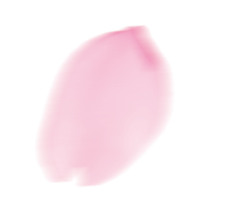

## 樱花效果
> 常见的樱花飘落js特效一般是通过引入这个js脚本:[sakura](https://blog-static.cnblogs.com/files/quaint/sakuraPlus.js)
1. 制作方法
    - 这个脚本是将图片转为base64：
        - base64转图片工具网址:[base-to-img](https://www.toolhelper.cn/Image/Base64?tab=base64#)
        - 图片

            

    - 原脚本直接调用可能问题
        - onload函数执行较早，浏览器是并行解码+执行函数，当onload执行完时，base64并未解析完
        - 等图片解析出来，不会挂载，导致无法显示
        - 解决方案：
        - 注释掉源代码里的挂载函数，在`<script>`部分用`setTimeout()`设置延时
2. 代码
```html
<!DOCTYPE html>
<html lang="zh">
<head>
    <meta charset="UTF-8">
    <meta name="viewport" content="width=device-width, initial-scale=1.0">
    <title>Sakura Demo</title>
</head>
<body>
    <script>
        // 与博客 DynamicEffectControl.vue 相同的方式加载本地 sakuraPlus.js
        const script = document.createElement('script')
        script.src = '../public/js/sakuraPlus.js'
        script.onload = function() {
            // 延迟 100ms 确保图片 base64 解码完成，然后直接调用 startSakura
            setTimeout(function() {
                if (typeof startSakura !== 'undefined') {
                    startSakura()
                }
            }, 100)
        }
        document.head.appendChild(script)
    </script>
</body>
</html>
```
---
## 雪花特效
> 雪花特效常见制作方法：CSS手搓，three.js脚本特效
> 不管哪种方式都要注意，背景色别弄成白色的
1. CSS样式制作方法：
    - 在屏幕上创建一个`fragment`容器，在该容器内创建`count`个`div`，该`div`的样式由JS代码生成
    - 配上`keyframe`动画
2. 代码
```html
<!DOCTYPE html>
<html lang="zh">
<head>
    <meta charset="UTF-8">
    <meta name="viewport" content="width=device-width, initial-scale=1.0">
    <title>Snow Demo - CSS 纯动画（博客当前方案）</title>
    <style>
        body {
            background: linear-gradient(180deg, #0a1628 0%, #1a2a4a 50%, #0d1b2a 100%);
            min-height: 100vh;
            overflow: hidden;
        }
        .snow-container {
            position: fixed;
            top: 0;
            left: 0;
            width: 100%;
            height: 100%;
            pointer-events: none;
            z-index: 100001;
            overflow: hidden;
        }
        .snowflake {
            position: absolute;
            top: -10px;
            background-color: #fff;
            border-radius: 50%;
            box-shadow: 0 0 10px rgba(255, 255, 255, 0.8);
            animation: snowfall linear infinite;
        }
        @keyframes snowfall {
            0% {
                transform: translateY(-10px) rotate(0deg);
                opacity: 0.8;
            }
            100% {
                transform: translateY(100vh) rotate(360deg);
                opacity: 0;
            }
        }
    </style>
</head>
<body>
    <div class="snow-container" id="snowContainer"></div>
    <script>
        function seededRandom(seed) {
            let x = Math.sin(seed * 127.1 + 311.7) * 43758.5453
            return x - Math.floor(x)
        }

        const container = document.getElementById('snowContainer')
        let count = 30
        const fragment = document.createDocumentFragment()

        for (let i = 0; i < count; i++) {
            let r1 = seededRandom(i * 7 + 1)
            let r2 = seededRandom(i * 7 + 2)
            let r3 = seededRandom(i * 7 + 3)
            let r4 = seededRandom(i * 7 + 4)
            let r5 = seededRandom(i * 7 + 5)
            let size = 5 + r5 * 12

            const flake = document.createElement('div')
            flake.className = 'snowflake'
            flake.style.left = (r1 * 100) + '%'
            flake.style.animationDelay = (r2 * 5) + 's'
            flake.style.animationDuration = (5 + r3 * 10) + 's'
            flake.style.opacity = 0.5 + r4 * 0.5
            flake.style.width = size + 'px'
            flake.style.height = size + 'px'

            fragment.appendChild(flake)
        }

        container.appendChild(fragment)
    </script>
</body>
</html>
```
3. three.js雪花特效的制作方法
    - three.js是一个3D特效库
    - 用该库制作的特效具有3D效果，但是体积大
    - 本文是直接调用别人写好的js脚本(这里下载到本地使用了)
4. 代码
```html
<!DOCTYPE html>
<html lang="zh">
<head>
    <meta charset="UTF-8">
    <meta name="viewport" content="width=device-width, initial-scale=1.0">
    <title>Snow Demo - Three.js 3D</title>
    <style>
        body {
            background: linear-gradient(180deg, #0a1628 0%, #1a2a4a 50%, #0d1b2a 100%);
            min-height: 100vh;
            overflow: hidden;
        }
        .snow-container {
            position: fixed;
            top: 0;
            left: 0;
            width: 100%;
            height: 100%;
            pointer-events: none;
            z-index: 9999;
        }
    </style>
</head>
<body>
    <div class="snow-container"></div>
    <script src="https://cdn.bootcdn.net/ajax/libs/jquery/3.6.0/jquery.min.js"></script>
    <script src="../public/js/snowy.js"></script>
</body>
</html>
```
---
> 编辑于2026-08-10

> 作者：Cnkrru

> 联系方式：3253884026@qq.com
