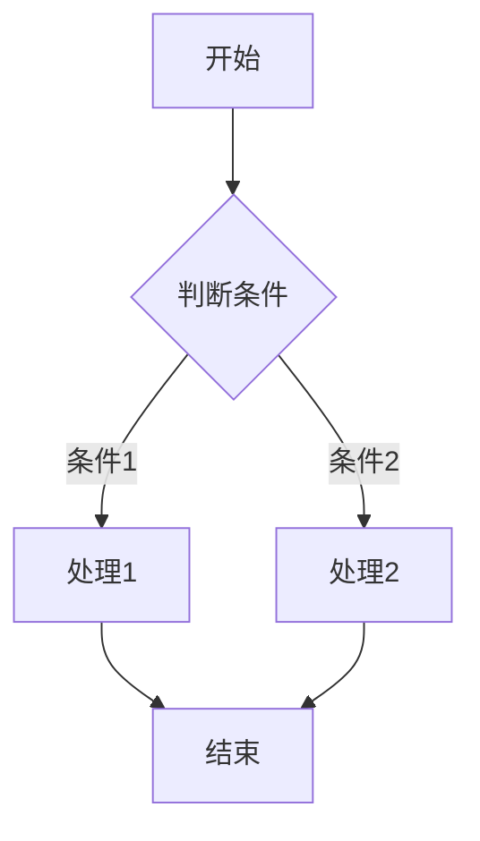
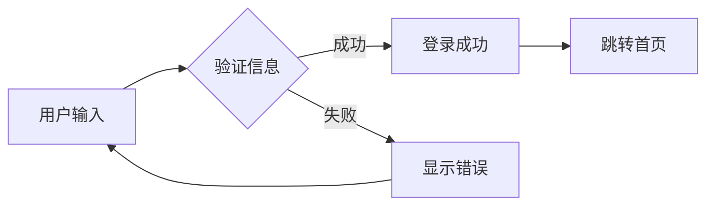
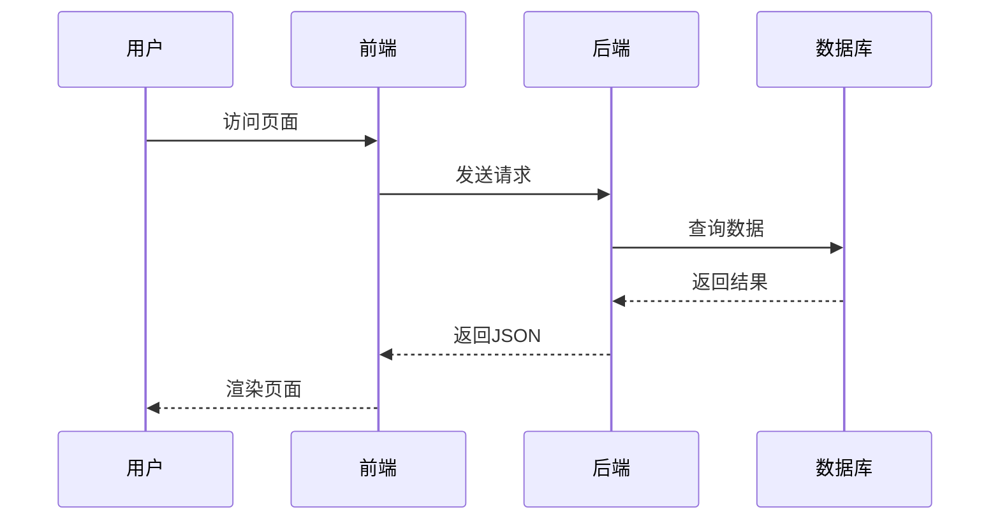
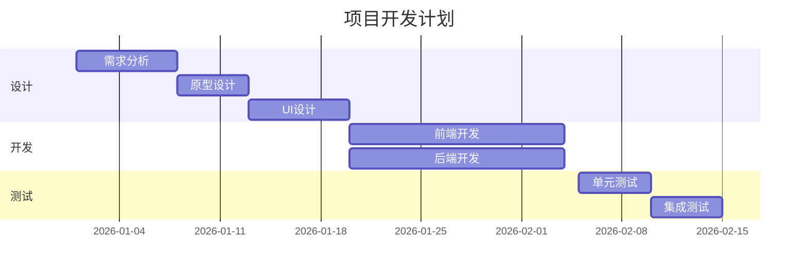
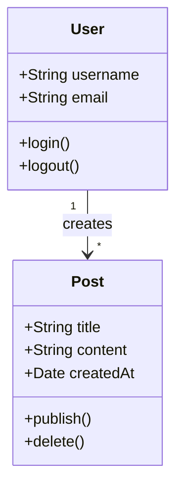
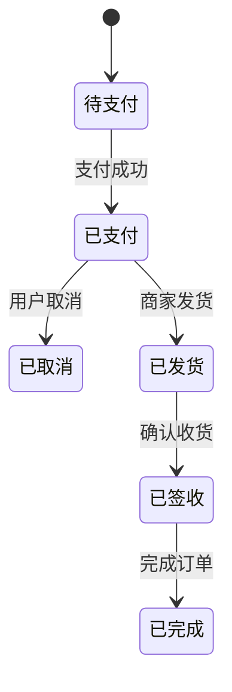

# 功能测试汇总

本文汇总测试博客的各项功能，包括Markdown渲染、代码高亮、灯箱功能、通知系统、KaTeX数学公式、Mermaid图表、CSV表格渲染等测试。

---

# 第一部分：Markdown测试

---

本文用于全面测试 Markdown 渲染功能，包括标题、段落、列表、链接、图片、表格等各种元素。

## 标题测试

# 一级标题 H1
## 二级标题 H2
### 三级标题 H3
#### 四级标题 H4
##### 五级标题 H5
###### 六级标题 H6

## 段落和文本格式

这是一段普通的段落文本。我在描述一个故事的片段，展现了Markdown的多样性和实用性。

**这是加粗文本**，用于强调重要的内容。

*这是斜体文本*，用于轻微的强调。

***这是加粗斜体文本***，用于非常强烈的强调。

~~这是删除线文本~~，用于表示已删除的内容。

`这是行内代码`，用于代码片段。

## 列表测试

### 无序列表

- 苹果
  - 红富士
  - 青苹果
  - 国光
- 香蕉
  - 黄香蕉
  - 芝麻香蕉
- 橙子
  - 脐橙
  - 血橙

### 有序列表

1. 第一步：准备材料
2. 第二步：混合原料
3. 第三步：搅拌均匀
4. 第四步：烘烤成品

### 任务列表

- [x] 完成项目计划
- [x] 设计数据库
- [ ] 编写前端代码
- [ ] 编写后端API
- [ ] 测试和部署

## 链接测试

[百度搜索](https://www.baidu.com)

[Google搜索](https://www.google.com)

[跳转到首页](/)

## 图片测试


## 表格测试

### 简单表格

| 姓名 | 年龄 | 城市 |
|------|------|------|
| 张三 | 25 | 北京 |
| 李四 | 30 | 上海 |
| 王五 | 28 | 广州 |

### 对齐表格

| 左对齐 | 居中对齐 | 右对齐 |
|:------|:-------:|------:|
| 内容1 | 内容2 | 内容3 |
| 内容4 | 内容5 | 内容6 |

## 引用测试

> 这是一段引用文本。
> 用于引用他人的观点或重要的信息。

> 多行引用：
> 第一行的引用内容
> 第二行的引用内容
> 第三行的引用内容

---

# 第二部分：代码高亮测试

---

本文用于测试代码高亮功能，支持多种编程语言的语法高亮。

## JavaScript

```javascript
async function fetchData(url) {
  try {
    const response = await fetch(url)
    const data = await response.json()
    return data
  } catch (error) {
    console.error('获取数据失败:', error)
    throw error
  }
}

// 使用Promise.all处理多个请求
const [users, posts] = await Promise.all([
  fetch('/api/users'),
  fetch('/api/posts')
])

console.log('用户数:', users.length)
console.log('文章数:', posts.length)
```

## Python

```python
from datetime import datetime

class BlogPost:
    def __init__(self, title, content, author):
        self.title = title
        self.content = content
        self.author = author
        self.created_at = datetime.now()

    def get_excerpt(self, length=100):
        """获取文章摘要"""
        if len(self.content) <= length:
            return self.content
        return self.content[:length] + '...'

    def __str__(self):
        return f"{self.title} by {self.author}"

# 创建实例
post = BlogPost(
    title="Python测试",
    content="这是一篇关于Python的测试文章...",
    author="博客作者"
)
print(post.get_excerpt())
```

## CSS

```css
/* 响应式卡片组件 */
.card {
  background: white;
  border-radius: 8px;
  box-shadow: 0 2px 8px rgba(0, 0, 0, 0.1);
  padding: 20px;
  transition: transform 0.3s ease, box-shadow 0.3s ease;
}

.card:hover {
  transform: translateY(-4px);
  box-shadow: 0 4px 16px rgba(0, 0, 0, 0.15);
}

.card-title {
  font-size: 1.25rem;
  font-weight: 600;
  color: #333;
  margin-bottom: 12px;
}
```

## HTML

```html
<!-- 文章卡片组件 -->
<article class="article-card">
  <header class="card-header">
    <h2 class="card-title">{{ article.title }}</h2>
    <div class="card-meta">
      <time datetime="{{ article.date }}">{{ article.formattedDate }}</time>
      <span class="card-category">{{ article.category }}</span>
    </div>
  </header>

  <div class="card-body">
    <p class="card-excerpt">{{ article.excerpt }}</p>
  </div>

  <footer class="card-footer">
    <div class="card-tags">
      <span v-for="tag in article.tags" :key="tag" class="tag">
        {{ tag }}
      </span>
    </div>
    <a :href="article.url" class="read-more">阅读更多 →</a>
  </footer>
</article>
```

## SQL

```sql
-- 博客数据库查询示例
SELECT
    p.id,
    p.title,
    p.created_at,
    u.username as author,
    COUNT(c.id) as comment_count,
    GROUP_CONCAT(t.name) as tags
FROM posts p
INNER JOIN users u ON p.user_id = u.id
LEFT JOIN comments c ON p.id = c.post_id
LEFT JOIN post_tags pt ON p.id = pt.post_id
LEFT JOIN tags t ON pt.tag_id = t.id
WHERE p.status = 'published'
    AND p.created_at >= '2026-01-01'
GROUP BY p.id, p.title, p.created_at, u.username
ORDER BY p.created_at DESC
LIMIT 10;
```

---

# 第三部分：KaTeX数学公式测试

---

本文用于测试 KaTeX 数学公式渲染功能，支持行内公式和行间公式。

## 行内公式

行内公式示例：这是一元二次方程 $ax^2 + bx + c = 0$ 的求解公式。

勾股定理：$a^2 + b^2 = c^2$

欧拉公式：$e^{i\pi} + 1 = 0$

## 行间公式

### 二次方程求根公式

$$x = \frac{-b \pm \sqrt{b^2 - 4ac}}{2a}$$

### 欧拉恒等式

$$e^{i\pi} + 1 = 0$$

这个公式被认为是数学中最美丽的公式，因为它包含了五个最重要的数学常数。

### 定积分

$$\int_{a}^{b} f(x) \, dx = F(b) - F(a)$$

其中 $F(x)$ 是 $f(x)$ 的原函数。

### 极限定义

$$\lim_{n \to \infty} \left(1 + \frac{1}{n}\right)^n = e$$

### 矩阵运算

$$
\begin{pmatrix}
a_{11} & a_{12} \\
a_{21} & a_{22}
\end{pmatrix}
\begin{pmatrix}
x \\
y
\end{pmatrix}
=
\begin{pmatrix}
b_{1} \\
b_{2}
\end{pmatrix}
$$

### 求和公式

$$\sum_{i=1}^{n} i = \frac{n(n+1)}{2}$$

### 概率论

**正态分布概率密度函数：**

$$f(x) = \frac{1}{\sigma\sqrt{2\pi}} e^{-\frac{(x-\mu)^2}{2\sigma^2}}$$

### 物理学

**质能方程：**

$$E = mc^2$$

---

# 第四部分：Mermaid图表测试

---

本文用于测试 Mermaid 图表渲染功能，支持流程图、时序图、甘特图等多种图表类型。

## 流程图

### 简单流程图



### 用户登录流程



## 时序图

### 用户请求时序



## 甘特图

### 项目计划



## 类图

### 博客系统类图



## 状态图

### 订单状态流转



---

# 第五部分：灯箱功能测试

---

这是一个测试灯箱功能的文章。点击下面的图片，应该会打开灯箱。


## 测试说明

1. 点击上面的任意图片，应该会打开灯箱
2. 在灯箱中，可以使用左右箭头切换图片
3. 点击右上角的关闭按钮，或者按 ESC 键，应该可以关闭灯箱
4. 点击灯箱外部的区域，应该也可以关闭灯箱

---

# 第六部分：通知系统 & 提示块测试

---

::: info 通知系统介绍
通知系统是博客的一个重要功能，它可以在用户执行某些操作（如复制代码）时，在页面右上角弹出提示信息，提升用户体验。Toast 通知通过 `window.toast` 全局 API 调用。
:::

## Toast 通知测试

点击下面的按钮来测试 Toast 通知功能：

<msg:info>通用通知</msg:info>
<msg:success>成功通知</msg:success>
<msg:error>错误通知</msg:error>
<msg:warning>警告通知</msg:warning>
<msg:info>信息通知</msg:info>

::: tip 小提示
Toast 通知支持 4 种类型：`success`（3秒）、`error`（5秒）、`warning`（4秒）、`info`（3秒）。鼠标悬停会暂停自动消失，支持带操作按钮的高级通知。
:::

## Admonition 提示块测试

以下使用 `:::type` 语法测试各类行内提示块：

::: info 这是信息提示块
用于展示**一般性信息**，支持 `行内代码`、[链接](https://cnkrru.top)等 Markdown 语法。
:::

::: success 操作成功
任务已成功完成！所有数据已保存到数据库。
:::

::: warning 注意
此操作会覆盖现有配置，请确认后再执行。建议先**备份**原有设置。
:::

::: error 错误
连接超时，无法访问远程服务器。请检查网络设置后重试。
:::

::: tip 小技巧
使用 `Ctrl + Shift + P` 可以快速打开命令面板，搜索你需要的功能。
:::

::: note 笔记
这是一条笔记类型的提示块，适合记录需要记住的信息。
:::

::: danger 危险操作
此操作**不可逆**！删除后数据将无法恢复，请谨慎操作。
:::

## Toast 通知的应用场景

::: note 常见场景
- **操作成功**：用户执行操作成功后显示成功通知
- **操作失败**：操作失败时显示错误通知及原因
- **提醒信息**：重要提醒或时效性信息
- **系统通知**：系统维护、更新等通知
:::

---

# 第七部分：CSV表格渲染测试

---

本文用于测试 CSV 代码块的表格渲染功能。使用 csv 语言标记的代码块，会自动将 CSV 数据渲染为可读表格，支持主题自适应。

## 基本表格

以下是一个简单的用户数据 CSV：

```csv
姓名,年龄,城市,职业
张三,25,北京,工程师
李四,30,上海,设计师
王五,28,广州,产品经理
赵六,35,深圳,架构师
```

## 带引号的字段

当字段中包含逗号时，需要用双引号包裹：

```csv
书名,作者,价格,简介
"JavaScript高级程序设计","Matt Frisbie",89.00,"JavaScript经典红宝书，前端必读"
"深入浅出Vue.js","刘博文",79.00,"Vue.js源码解析，深入理解响应式原理"
"CSS世界","张鑫旭",69.00,"CSS流、元素与基本尺寸的深入讲解"
"设计模式","Erich Gamma",99.00,"面向对象软件设计模式经典之作"
```

## 多列数据

```csv
月份,销售额,利润,利润率,客户数,客单价
1月,128000,25600,20.0%,320,400
2月,145000,30450,21.0%,380,382
3月,132000,26400,20.0%,350,377
4月,168000,38640,23.0%,420,400
5月,156000,34320,22.0%,400,390
6月,182000,43680,24.0%,460,396
```

## 纯数据（无表头）

如果 CSV 只有一行数据，则不分表头/表体：

```csv
2026-08-12,功能测试,CSV解析器,通过
```

---

# 第八部分：JSON/YAML/TOML 结构化数据渲染测试

---

本文用于测试 JSON、YAML、TOML 三种结构化数据格式的渲染功能。三种格式都会渲染为可交互的树形结构视图，支持查看源码和复制功能。JSON 使用原生解析器，TOML 使用内建解析器，YAML 通过 CDN 加载 js-yaml 解析。

## JSON 测试

### 基本 JSON 对象

```json
{
  "name": "张三",
  "age": 28,
  "city": "北京",
  "isActive": true,
  "score": 95.5,
  "bio": null
}
```

### 嵌套 JSON 对象

```json
{
  "user": {
    "profile": {
      "firstName": "John",
      "lastName": "Doe",
      "contact": {
        "email": "john@example.com",
        "phone": "+86-138-0000-0001",
        "address": {
          "street": "中关村大街",
          "city": "北京",
          "zip": "100080"
        }
      }
    },
    "preferences": {
      "theme": "dark",
      "notifications": true,
      "language": "zh-CN"
    }
  }
}
```

### JSON 数组

```json
[
  {
    "id": 1,
    "title": "Vue 3 入门指南",
    "author": "张三",
    "tags": ["Vue", "前端", "JavaScript"],
    "published": true,
    "views": 1520
  },
  {
    "id": 2,
    "title": "TypeScript 高级类型",
    "author": "李四",
    "tags": ["TypeScript", "类型系统"],
    "published": true,
    "views": 980
  },
  {
    "id": 3,
    "title": "CSS 网格布局实战",
    "author": "王五",
    "tags": ["CSS", "布局"],
    "published": false,
    "views": 450
  }
]
```

### 混合类型 JSON

```json
{
  "metadata": {
    "version": "2.0.1",
    "generatedAt": "2026-08-12T10:30:00Z",
    "count": 100,
    "isValid": true,
    "checksum": null
  },
  "data": {
    "metrics": [12.5, 45.3, 78.1, 23.9, 67.2],
    "labels": ["Q1", "Q2", "Q3", "Q4"],
    "flags": [true, false, true, true],
    "mixed": [1, "two", false, null, { "nested": true }]
  },
  "empty": {},
  "deeplyNested": {
    "level1": {
      "level2": {
        "level3": {
          "level4": {
            "value": "太深了，默认折叠到第3层"
          }
        }
      }
    }
  }
}
```

### 无效 JSON（展示错误处理）

```json
{
  "name": "测试",
  "age": 25,
  "city": "深圳",
  语法错误: 缺少引号
}
```

## YAML 测试

### 基本 YAML

```yaml
name: 张三
age: 28
city: 北京
isActive: true
score: 95.5
bio: ~
```

### 嵌套 YAML

```yaml
user:
  profile:
    firstName: John
    lastName: Doe
    contact:
      email: john@example.com
      phone: "+86-138-0000-0001"
      address:
        street: 中关村大街
        city: 北京
        zip: "100080"
  preferences:
    theme: dark
    notifications: true
    language: zh-CN
```

### YAML 列表

```yaml
articles:
  - id: 1
    title: Vue 3 入门指南
    author: 张三
    tags:
      - Vue
      - 前端
      - JavaScript
    published: true
    views: 1520
  - id: 2
    title: TypeScript 高级类型
    author: 李四
    tags:
      - TypeScript
      - 类型系统
    published: true
    views: 980
  - id: 3
    title: CSS 网格布局实战
    author: 王五
    tags:
      - CSS
      - 布局
    published: false
    views: 450
```

### YAML 多行字符串与特殊值

```yaml
description: >
  这是一个多行字符串，
  会被折叠为一行。
notes: |
  这是一个保留换行的
  多行字符串。
empty_val: ~
null_val: null
boolean_true: yes
boolean_false: no
numbers:
  integer: 42
  float: 3.14
  scientific: 1.5e+10
  hex: 0x1A
timestamp: 2026-08-12T10:30:00Z
```

### 无效 YAML（展示错误处理）

```yaml
name: 测试
age: 25
  indent: 缩进错误
broken: [
```

## TOML 测试

### 基本 TOML

```toml
title = "TOML示例"
name = "张三"
age = 28
isActive = true
score = 95.5
```

### 嵌套 TOML（表）

```toml
[user]
name = "张三"
email = "zhangsan@example.com"

[user.profile]
bio = "全栈开发者"
website = "https://example.com"

[user.settings]
theme = "dark"
language = "zh-CN"
notifications = true
```

### TOML 数组

```toml
tags = ["Vue", "前端", "JavaScript"]
scores = [85, 92, 78, 95]
flags = [true, false, true]

[[articles]]
id = 1
title = "Vue 3 入门指南"
author = "张三"
published = true
views = 1520

[[articles]]
id = 2
title = "TypeScript 高级类型"
author = "李四"
published = true
views = 980

[[articles]]
id = 3
title = "CSS 网格布局实战"
author = "王五"
published = false
views = 450
```

### TOML 多级嵌套表与日期

```toml
title = "项目配置"
version = "2.0.1"

[build]
optimizer = "esbuild"
sourcemap = true

[build.output]
dir = "dist"
format = "esm"
minify = true

[build.output.banner]
js = "/* build */"
css = "/* build */"

[deploy]
host = "example.com"
port = 443
ssl = true

[deploy.timeline]
created = 2026-01-15T08:00:00Z
updated = 2026-08-12T10:30:00Z
```

### 无效 TOML（展示错误处理）

```toml
title = "测试"
age = 25
city = "深圳"
invalid = 没有引号的值
```

## 说明

- `json`、`yaml`、`toml` 代码块会渲染为**结构化树形视图**，默认展示预览模式
- 可点击"源码"按钮切换为原始代码（带 Prism 语法高亮）
- 支持**一键复制**代码内容
- 解析失败时，自动切换到源码视图并显示错误信息
- JSON 使用原生 `JSON.parse`，TOML 使用内建解析器，YAML 通过 CDN 加载 js-yaml（首次使用需加载，后续自动缓存）