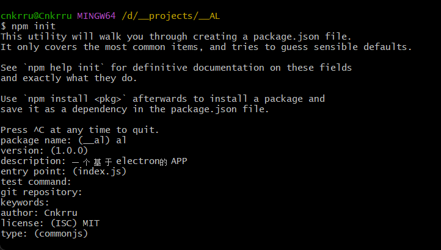
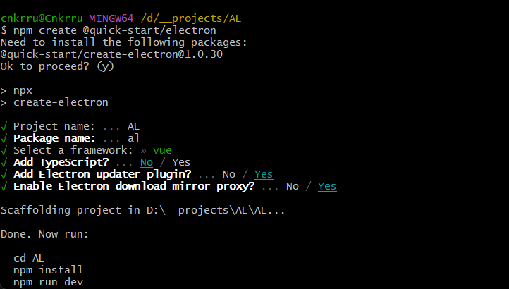
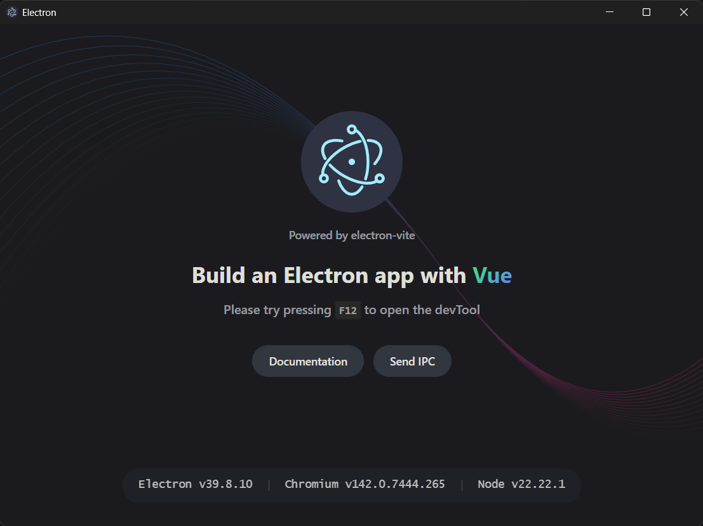

# 引文
> AL是个人基于electron开发的APP，主要是个人用，也会开源，没什么目标，想要什么功能自己学，自己写
---
## 介绍
> 中文官网:[https://www.electronjs.org/zh/](https://www.electronjs.org/zh/)
- electron是一个桌面端APP框架，一份源码，可编译为Windows，MACOS，liunx
- electron相当于谷歌浏览器+node.js，谷歌浏览器负责前端渲染，node.js负责后端运行，因为依赖比较重，所以打包完APP的体积比较大
- 基于electron开发的APP的例子：QQ
- 虽然新的APP框架更偏向于只借用浏览器的渲染模块webview+后端运行时，但是作者本人觉得electron生态成熟，开发快速，决定用这个
---
## 初始化
### 1. `npm init`
- 先初始化一个JavaScript项目，作者这里用的包管理器是npm，官方文档说可以用yarn，爱用啥用啥
- 初始化会问几个问题，如图：



- 问完问题后，会生成配置文件`package.json`,JavaScript项目的配置文件
- 以下是官网示例，自己初始化的没有`devdependencies`,就是依赖，自己手动添加一下
```json
{
  "name": "my-electron-app",
  "version": "1.0.0",
  "description": "Hello World!",
  "main": "main.js",
  "scripts": {
    "test": "echo \"Error: no test specified\" && exit 1"
  },
  "author": "Jane Doe",
  "license": "MIT",
  "devDependencies": {
    "electron": "23.1.3"
  }
}
```
- 添加完依赖json段后运行`npm instll`(都是常见项目指令了，换其他包/其他语言，基本都差别不大)
- 依赖包`node_modules`，很常见了，记得git忽视掉,JavaScript项目安装依赖，简直是灾难，一个依赖依赖于另一个依赖，一次下载一堆，下载很慢，稍微等一下
- 下载慢了用镜像或者挂VPN，看文档:[下载文档](https://www.electronjs.org/zh/docs/latest/tutorial/installation)
- 安装完成后会生成一个`package-lock.json`,这个是依赖版本控制锁，别管，不用自己管理
> 注意：你init时，问`main`字段，指的是后端入口文件，不填默认`index.js`，你如果要用main.js，改一下，不过两边改哪个都行，无所谓了，不必纠结，看喜好
---
### 2. gitignore
- 官网说要添加git忽视文件，这个也是很常见的文件了，rust的cargo好像是会在初始化项目时自己生成，忘记了，了解过一点rust，也写过一点点，但是不是很喜欢。
- 写法：
```
<文件名>
<文件夹名>/
```
> 盘符用`/`，因为GitHub的服务器用的是liunx，不过服务器基本都是liunx吧，写好这个后，git在提交时会自动忽视这个文件里记录的文件/文件夹
---
### 3. 后端入口文件与运行
- main.js，不管哪种语言，基本都是main作为入口，行业惯例
- 运行：
    - 在`package.json`里的`script`里补一句:
    ```shell
    start:'electron .'
    ```
    - 应该是electron的CLI在当前文件夹启动项目的意思
---
### 4. 前端入口文件
- index.html，前端网页常见，一般根目录放一个，其他的组件/页面放到文件夹里
- 官网示例：
```html
<!DOCTYPE html>
<html>
  <head>
    <meta charset="UTF-8" />
    <!-- https://developer.mozilla.org/en-US/docs/Web/HTTP/CSP -->
    <meta
      http-equiv="Content-Security-Policy"
      content="default-src 'self'; script-src 'self'"
    />
    <meta
      http-equiv="X-Content-Security-Policy"
      content="default-src 'self'; script-src 'self'"
    />
    <title>Hello from Electron renderer!</title>
  </head>
  <body>
    <h1>Hello from Electron renderer!</h1>
    <p>👋</p>
  </body>
</html>
```
- 跟普通网页没啥区别
---
### 5. 前后端链接
- main.js修改一下：
```js
const { app, BrowserWindow } = require('electron')

const createWindow = () => {
  const win = new BrowserWindow({
    width: 800,
    height: 600
  })

  win.loadFile('index.html')
}

app.on('ready', () => {
  createWindow()
})
```
- 这个其实和其他APP框架看着都差不多，初始化一个实例，然后给宽高属性，窗口加载是`index.html`
- 导入了两个electron的包`app`和`BrowserWindow`
    - app管生命周期
    - BrowserWindow很显然管前端
- app.on这个比较像前端的`addEventLister(<mode>,<fn>)`，实际效果也差不多，绑定事件
> 这时运行npm run start可以运行APP了
---
### 6. 管理生命周期
- 官网示例:
```javascript
app.on('window-all-closed', () => {
  if (process.platform !== 'darwin') app.quit()
})
```
- 如果不是MACOS，`app.quit`关闭全部窗口后退出
---
### 7. 预加载脚本
- preload.js
- 因为electron是前后端分离的设计，前端渲染和后端服务各一个进程，需要进程间通信(IPC),该脚本用于进程间桥接
- 文档:[preload](https://www.electronjs.org/zh/docs/latest/tutorial/tutorial-preload)
- 官网给的脚本内容如下：
```javascript
const { contextBridge } = require('electron')

contextBridge.exposeInMainWorld('versions', {
  node: () => process.versions.node,
  chrome: () => process.versions.chrome,
  electron: () => process.versions.electron
  // 除函数之外，我们也可以暴露变量
})
```
- 同时修改main.js，加入预加载脚本挂载，具体位置看官网
```JavaScript
webPreferences: {preload: path.join(__dirname, 'preload.js')}
```
- 这里的`__dirname`，接收的参数是脚本的路径，一般情况下我们不会直接放在根目录，需要修改一下
---
### 8. 查看版本信息
- 官方文档说下一步要创建一个render.js，用于接收`preload.js`刚才创建的三个版本参数，这里直接写html内部了
```html
<!DOCTYPE html>
<html>
  <head>
    <meta charset="UTF-8" />
    <meta
      http-equiv="Content-Security-Policy"
      content="default-src 'self'; script-src 'self'"
    />
    <meta
      http-equiv="X-Content-Security-Policy"
      content="default-src 'self'; script-src 'self'"
    />
    <title>来自 Electron 渲染器的问好！</title>
  </head>
  <body>
    <h1>来自 Electron 渲染器的问好！</h1>
    <p>👋</p>
    <p id="info"></p>
  </body>
  <script>
    const information = document.getElementById('info')
    information.innerText = `本应用正在使用 Chrome (v${versions.chrome()}), Node.js (v${versions.node()}), 和 Electron (v${versions.electron()})`
  </script>
</html>
```
---
### 9. 进程间通信
- 进程间通信主要在`preload.js`中进行配置
- 前端`invoke`,后端`handle`
- 这个之后单独一个板块说
---
### 10.打包
- 打包要用打包工具，这里官方直接给指令来安装打包工具：
- 文档:[打包](https://www.electronjs.org/zh/docs/latest/tutorial/%E6%89%93%E5%8C%85%E6%95%99%E7%A8%8B)
```shell
# 安装打包工具CLI
npm install --save-dev @electron-forge/cli
```
- 配置打包工具
```shell
npx electron-forge import
```
- 运行完这一行会出现一个新的配置文件`forge.config.js`，`package.json`也会出现对应指令
    - forge.config.js是代码签名文件，暂时不知道是干什么的
---
### 11. 发布与更新
- 日后再说
---
## electron+vue初始化
> electron前端部分支持很多前端框架，作者学过并习惯用vue，所以AL前端部分用vue开发
> 初始化这块，部分文档的教学落后了，不一定对，本篇博客也不一定对，只是当时可行，可能官方把CLI改动了一下
---
### 1. 初始化
- 运行以下指令快速开始，生成的模板很标准
```shell
npm create @quick-start/electron
```
- 会问以下几个问题



- 项目名
- 包名
- 框架(这里用vue，还有几个，比如react，还有谷歌那个，忘记叫什么了)
- 是否支持ts
- 是否安装electron更新插件
- 是否启用镜像源
---
### 2. 源码文件夹结构
```
src
|-main
|   |-main.js
|-preload
|   |-preload.js  
|-render 
|   |-vue项目框架
```
---
### 3. 初始化效果



---
> 编辑于2026-08-11

> 作者：Cnkrru

> 联系方式：3253884026@qq.com