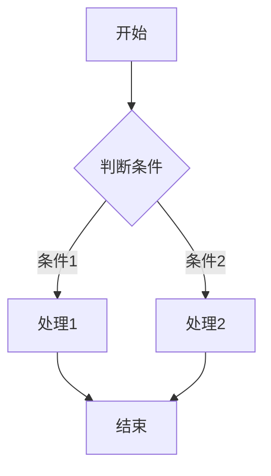
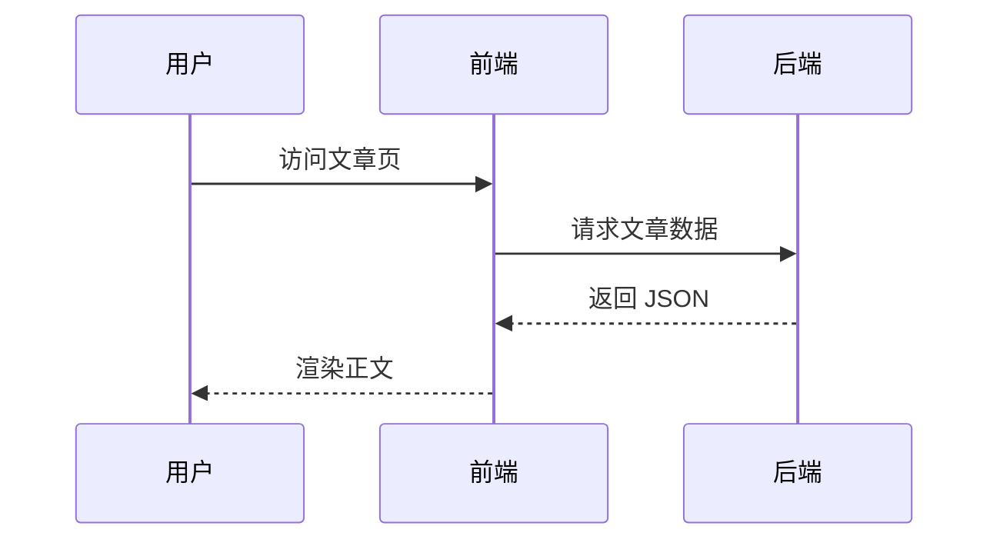

# Hello World

## 前言

- 还是照常先来一次`hello world`,庆祝这个博客完工(或许以后会做一些小组件之类的)，这个博客，我开发了四个星期左右，2026-09-06一直做到2026-10-04，挺长时间，也学了不少
- vue的特性用的不多，`{{插值}}`,`v-if`,`v-for`,`v-bind`用了一些，其他的不怎么用，作为新手，还是偏向于写ts(js)，一开始用js开发，但是代码类型不清，也没配置代码规范工具，写起来快，但是可读性一般，用ts后，有一套配套代码工具，而且初始化vue项目都一键配置好了，挺方便
- 也用AI辅助开发了，总共8500行左右的代码，其中15%左右是AI写的，主要集中在CSS的颜色样式和媒体查询，这两个我写的真不如它，反正只是调颜色和大小，让它做不影响什么，还有一些功能的快速开发也是它做的，代码我都读一遍，学会了之后，再照着写一遍，挺有收获

- 功能介绍:
  1. md->html:依赖于markdown-it
  2. ssg:依赖于vite-ssg以及vue-router
  3. 语法高亮:依赖于shiki
  4. mermaid:依赖于mermaid.js
  5. katex:依赖于md-it的katex插件
  6. 提示块:依赖于md-it的md-it-container插件
  7. 评论区:依赖于giscus
  8. 搜索:依赖于minisearch
  9. 音乐:依赖于howler
  10. 灯箱:依赖于medium-zoom

## 功能测试

### md测试

基础 Markdown 渲染测试，覆盖文本格式、列表、任务列表、表格、引用与链接。

**加粗文本**、_斜体文本_、_**加粗斜体**_、~~删除线~~、`行内代码`。

- 无序列表项一
  - 嵌套子项
  - 嵌套子项
- 无序列表项二

1. 有序列表项一
2. 有序列表项二

- [x] 已完成的任务
- [ ] 待完成的任务

| 功能     | 依赖        | 状态 |
| -------- | ----------- | :--: |
| 正文渲染 | markdown-it | 通过 |
| 代码高亮 | shiki       | 通过 |
| 数学公式 | katex       | 通过 |

> 这是一段引用文本，
> 支持多行内容。

[站内链接](/postlist)、[外部链接](https://cnkrru.top)。

### 代码块测试

代码块在编译期由 shiki 高亮，右上角带语言徽章与复制按钮。

```javascript
// 按日期倒序排列文章
const sortByDate = (posts) => [...posts].sort((a, b) => new Date(b.date) - new Date(a.date))

console.log(sortByDate(postList))
```

```python
def reading_time(word_count: int, speed: int = 300) -> int:
    """按每分钟 300 字估算阅读时长，最少 1 分钟"""
    return max(1, -(-word_count // speed))
```

```css
/* 卡片悬浮态 */
.card {
  border-radius: 8px;
  transition:
    transform 0.3s ease,
    box-shadow 0.3s ease;
}

.card:hover {
  transform: translateY(-4px);
  box-shadow: 0 4px 16px rgba(0, 0, 0, 0.15);
}
```

```bash
npm install
npm run dev
npm run build
```

### katex测试

行内公式：一元二次方程 $ax^2 + bx + c = 0$ 的求根公式为 $x = \dfrac{-b \pm \sqrt{b^2 - 4ac}}{2a}$。

行间公式：

$$
\int_{a}^{b} f(x) \, dx = F(b) - F(a)
$$

$$
\lim_{n \to \infty} \left(1 + \frac{1}{n}\right)^n = e
$$

$$
\sum_{i=1}^{n} i = \frac{n(n+1)}{2}
$$

### mermaid测试





### 灯箱测试

点击图片由 medium-zoom 打开灯箱，支持滚轮缩放、拖拽平移、ESC 关闭。


### 提示块测试

`:::type 可选标题` 语法支持 tip / info / warn / error 四种等级。

::: tip 小提示
提示块内容支持 `行内代码`、**加粗**、[链接](https://cnkrru.top) 等 Markdown 语法。
:::

::: info 信息
用于展示一般性说明信息。
:::

::: warn 警告
此操作会覆盖现有配置，请确认后再执行。
:::

::: error 错误
连接超时，无法访问远程服务器，请检查网络后重试。
:::
