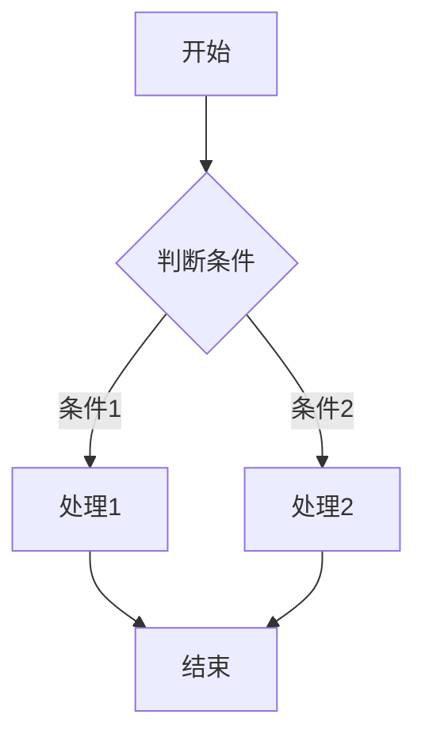
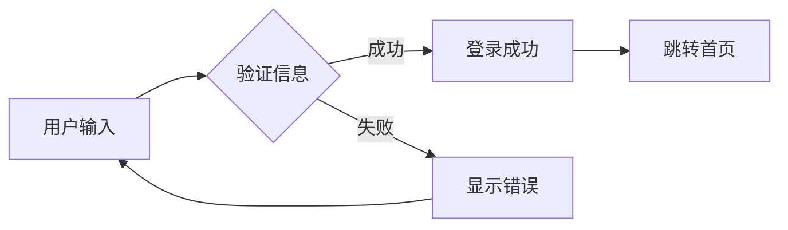
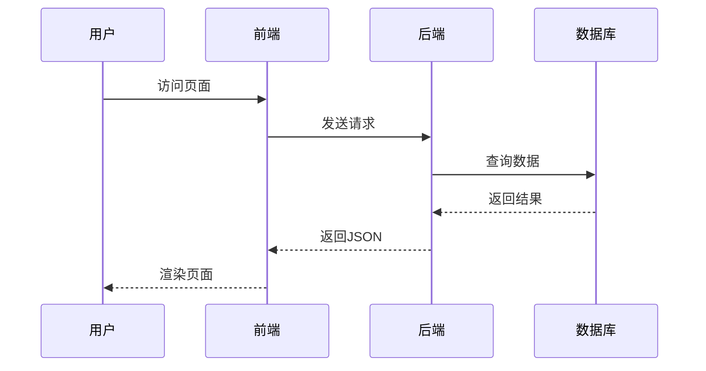
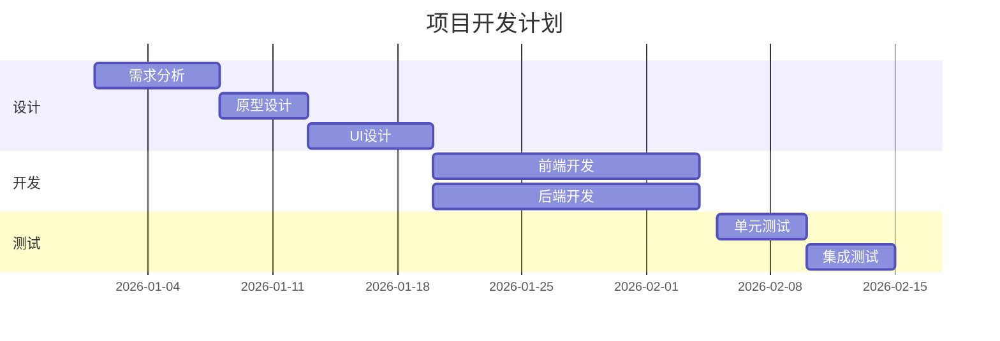
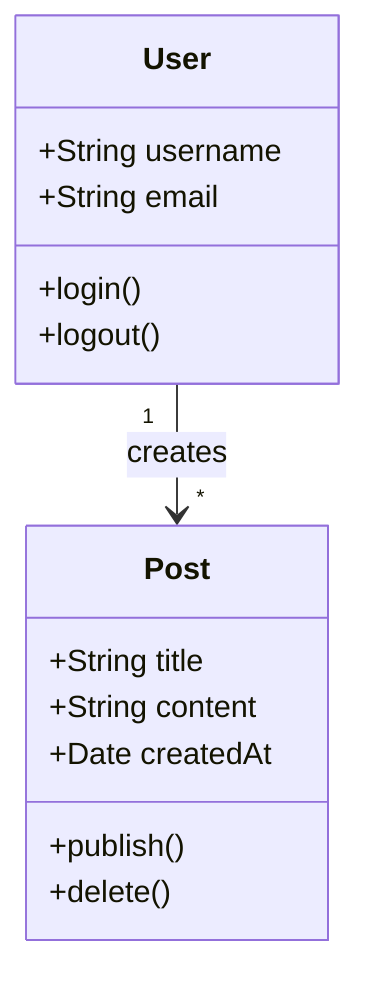
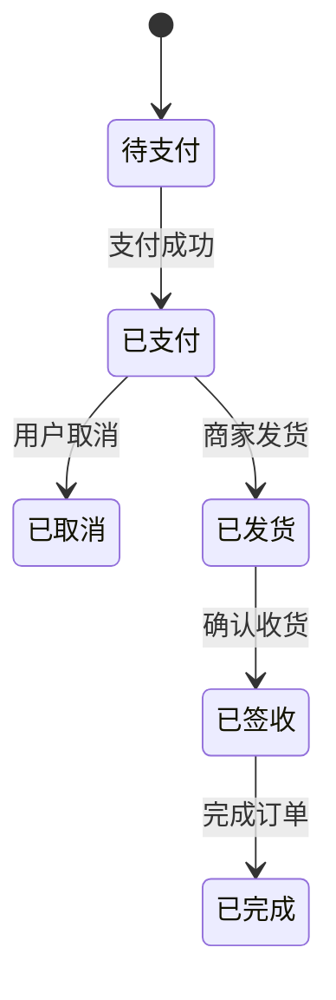

# 功能测试汇总

本文汇总测试博客的各项功能，包括Markdown渲染、代码高亮、灯箱功能、通知系统、KaTeX数学公式、Mermaid图表等测试。

---

# 🎨 第一部分：Markdown测试

---

本文用于全面测试 Markdown 渲染功能，包括标题、段落、列表、链接、图片、表格等各种元素。

## 标题测试

# 一级标题 H1
## 二级标题 H2
### 三级标题 H3
#### 四级标题 H4
##### 五级标题 H5
###### 六级标题 H6

## 段落和文本格式

这是一段普通的段落文本。我在描述一个故事的片段，展现了Markdown的多样性和实用性。

**这是加粗文本**，用于强调重要的内容。

*这是斜体文本*，用于轻微的强调。

***这是加粗斜体文本***，用于非常强烈的强调。

~~这是删除线文本~~，用于表示已删除的内容。

`这是行内代码`，用于代码片段。

## 列表测试

### 无序列表

- 苹果
  - 红富士
  - 青苹果
  - 国光
- 香蕉
  - 黄香蕉
  - 芝麻香蕉
- 橙子
  - 脐橙
  - 血橙

### 有序列表

1. 第一步：准备材料
2. 第二步：混合原料
3. 第三步：搅拌均匀
4. 第四步：烘烤成品

### 任务列表

- [x] 完成项目计划
- [x] 设计数据库
- [ ] 编写前端代码
- [ ] 编写后端API
- [ ] 测试和部署

## 链接测试

[百度搜索](https://www.baidu.com)

[Google搜索](https://www.google.com)

[跳转到首页](/)

## 图片测试


## 表格测试

### 简单表格

| 姓名 | 年龄 | 城市 |
|------|------|------|
| 张三 | 25 | 北京 |
| 李四 | 30 | 上海 |
| 王五 | 28 | 广州 |

### 对齐表格

| 左对齐 | 居中对齐 | 右对齐 |
|:------|:-------:|------:|
| 内容1 | 内容2 | 内容3 |
| 内容4 | 内容5 | 内容6 |

## 引用测试

> 这是一段引用文本。
> 用于引用他人的观点或重要的信息。

> 多行引用：
> 第一行的引用内容
> 第二行的引用内容
> 第三行的引用内容

---

# 💻 第二部分：代码高亮测试

---

本文用于测试代码高亮功能，支持多种编程语言的语法高亮。

## JavaScript

```javascript
async function fetchData(url) {
  try {
    const response = await fetch(url)
    const data = await response.json()
    return data
  } catch (error) {
    console.error('获取数据失败:', error)
    throw error
  }
}

// 使用Promise.all处理多个请求
const [users, posts] = await Promise.all([
  fetch('/api/users'),
  fetch('/api/posts')
])

console.log('用户数:', users.length)
console.log('文章数:', posts.length)
```

## Python

```python

class BlogPost:
    def __init__(self, title, content, author):
        self.title = title
        self.content = content
        self.author = author
        self.created_at = datetime.now()

    def get_excerpt(self, length=100):
        """获取文章摘要"""
        if len(self.content) <= length:
            return self.content
        return self.content[:length] + '...'

    def __str__(self):
        return f"{self.title} by {self.author}"

# 创建实例
post = BlogPost(
    title="Python测试",
    content="这是一篇关于Python的测试文章...",
    author="博客作者"
)
print(post.get_excerpt())
```

## CSS

```css
/* 响应式卡片组件 */
.card {
  background: white;
  border-radius: 8px;
  box-shadow: 0 2px 8px rgba(0, 0, 0, 0.1);
  padding: 20px;
  transition: transform 0.3s ease, box-shadow 0.3s ease;
}

.card:hover {
  transform: translateY(-4px);
  box-shadow: 0 4px 16px rgba(0, 0, 0, 0.15);
}

.card-title {
  font-size: 1.25rem;
  font-weight: 600;
  color: #333;
  margin-bottom: 12px;
}
```

## HTML

```html
<!-- 文章卡片组件 -->
<article class="article-card">
  <header class="card-header">
    <h2 class="card-title">{{ article.title }}</h2>
    <div class="card-meta">
      <time datetime="{{ article.date }}">{{ article.formattedDate }}</time>
      <span class="card-category">{{ article.category }}</span>
    </div>
  </header>

  <div class="card-body">
    <p class="card-excerpt">{{ article.excerpt }}</p>
  </div>

  <footer class="card-footer">
    <div class="card-tags">
      <span v-for="tag in article.tags" :key="tag" class="tag">
        {{ tag }}
      </span>
    </div>
    <a :href="article.url" class="read-more">阅读更多 →</a>
  </footer>
</article>
```

## SQL

```sql
-- 博客数据库查询示例
SELECT
    p.id,
    p.title,
    p.created_at,
    u.username as author,
    COUNT(c.id) as comment_count,
    GROUP_CONCAT(t.name) as tags
FROM posts p
INNER JOIN users u ON p.user_id = u.id
LEFT JOIN comments c ON p.id = c.post_id
LEFT JOIN post_tags pt ON p.id = pt.post_id
LEFT JOIN tags t ON pt.tag_id = t.id
WHERE p.status = 'published'
    AND p.created_at >= '2026-01-01'
GROUP BY p.id, p.title, p.created_at, u.username
ORDER BY p.created_at DESC
LIMIT 10;
```

---

# 📐 第三部分：KaTeX数学公式测试

---

本文用于测试 KaTeX 数学公式渲染功能，支持行内公式和行间公式。

## 行内公式

行内公式示例：这是一元二次方程 $ax^2 + bx + c = 0$ 的求解公式。

勾股定理：$a^2 + b^2 = c^2$

欧拉公式：$e^{i\pi} + 1 = 0$

## 行间公式

### 二次方程求根公式

$$x = \frac{-b \pm \sqrt{b^2 - 4ac}}{2a}$$

### 欧拉恒等式

$$e^{i\pi} + 1 = 0$$

这个公式被认为是数学中最美丽的公式，因为它包含了五个最重要的数学常数。

### 定积分

$$\int_{a}^{b} f(x) \, dx = F(b) - F(a)$$

其中 $F(x)$ 是 $f(x)$ 的原函数。

### 极限定义

$$\lim_{n \to \infty} \left(1 + \frac{1}{n}\right)^n = e$$

### 矩阵运算

$$
\begin{pmatrix}
a_{11} & a_{12} \\
a_{21} & a_{22}
\end{pmatrix}
\begin{pmatrix}
x \\
y
\end{pmatrix}
=
\begin{pmatrix}
b_{1} \\
b_{2}
\end{pmatrix}
$$

### 求和公式

$$\sum_{i=1}^{n} i = \frac{n(n+1)}{2}$$

### 概率论

**正态分布概率密度函数：**

$$f(x) = \frac{1}{\sigma\sqrt{2\pi}} e^{-\frac{(x-\mu)^2}{2\sigma^2}}$$

### 物理学

**质能方程：**

$$E = mc^2$$

---

# 📊 第四部分：Mermaid图表测试

---

本文用于测试 Mermaid 图表渲染功能，支持流程图、时序图、甘特图等多种图表类型。

## 流程图

### 简单流程图



### 用户登录流程



## 时序图

### 用户请求时序



## 甘特图

### 项目计划



## 类图

### 博客系统类图



## 状态图

### 订单状态流转



---

# 🖼️ 第五部分：灯箱功能测试

---

这是一个测试灯箱功能的文章。点击下面的图片，应该会打开灯箱。


## 测试说明

1. 点击上面的任意图片，应该会打开灯箱
2. 在灯箱中，可以使用左右箭头切换图片
3. 点击右上角的关闭按钮，或者按 ESC 键，应该可以关闭灯箱
4. 点击灯箱外部的区域，应该也可以关闭灯箱

---

# 🔔 第六部分：通知系统测试

---

这是一篇测试通知系统的文章，我们将在这篇文章中测试博客的通知功能。

## 通知系统介绍

通知系统是博客的一个重要功能，它可以在用户执行某些操作时显示提示信息，提升用户体验。

## 测试通知功能

点击下面的按钮来测试通知功能：

<button onclick="if(window.toast) window.toast('这是一条测试通知')" class="test-button">测试通知</button>

## 通知类型

我们可以测试不同类型的通知：

<button onclick="if(window.toast && window.toast.success) window.toast.success('操作成功！')" class="test-button">成功通知</button>
<button onclick="if(window.toast && window.toast.error) window.toast.error('操作失败！')" class="test-button">错误通知</button>
<button onclick="if(window.toast && window.toast.warning) window.toast.warning('警告信息！')" class="test-button">警告通知</button>
<button onclick="if(window.toast && window.toast.info) window.toast.info('这是一条信息通知')" class="test-button">信息通知</button>

## 通知系统的应用场景

通知系统可以应用在以下场景：

1. **操作成功**：当用户执行某个操作成功时，显示成功通知
2. **操作失败**：当用户执行某个操作失败时，显示错误通知
3. **提醒信息**：显示一些重要的提醒信息
4. **系统通知**：显示系统相关的通知

---

<style>
.test-button {
  display: inline-block;
  padding: 8px 16px;
  margin: 5px;
  background-color: var(--button-bg);
  color: var(--button-text);
  border: 1px solid var(--button-border);
  border-radius: 8px;
  font-size: 14px;
  cursor: pointer;
  transition: all 0.3s ease;
}

.test-button:hover {
  background-color: var(--button-hover-bg);
  transform: translateY(-3px);
}
</style>

----------------------------------------------------------------
- 如有建议，请联系我，邮箱：3253884026@qq.com
