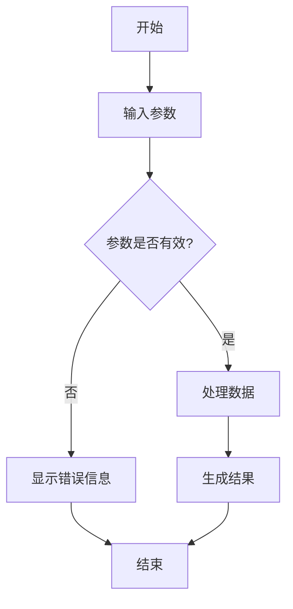
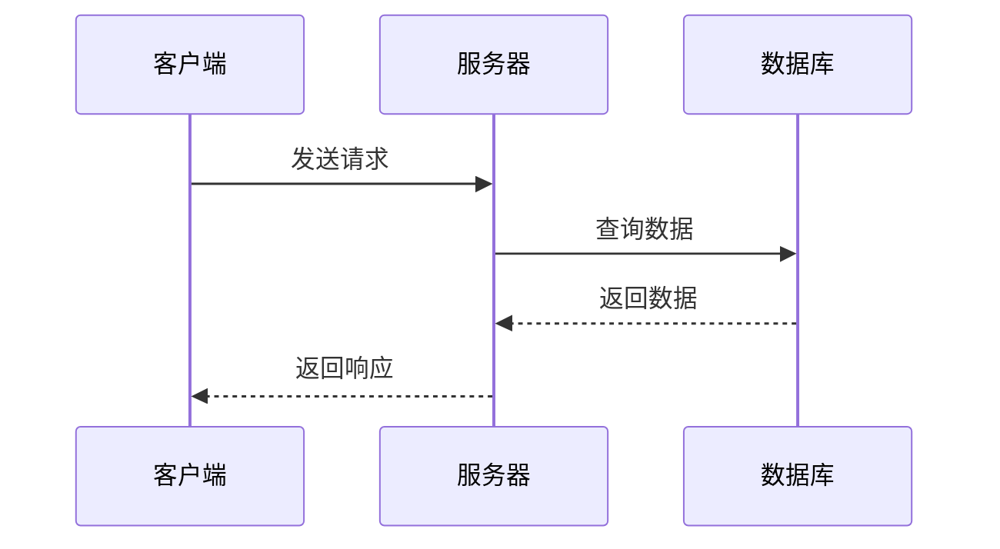
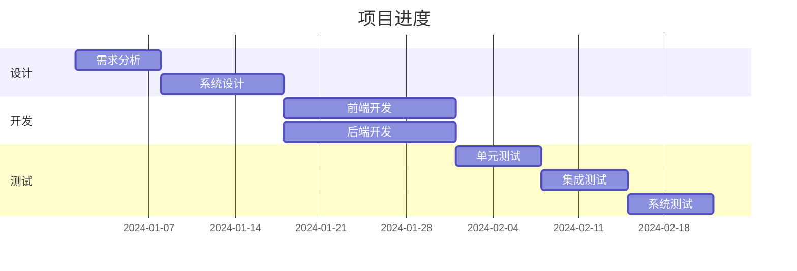
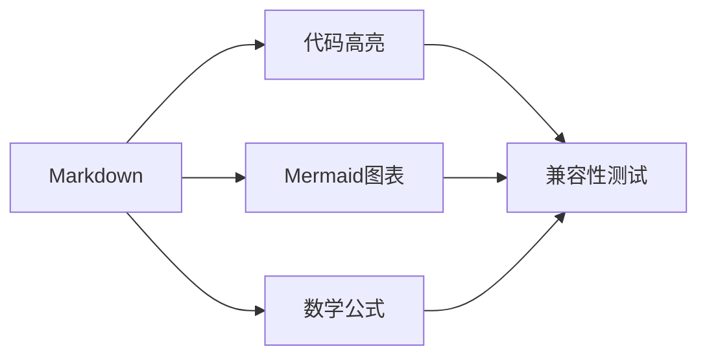

# Markdown兼容性测试

## 1. 代码高亮测试

### JavaScript代码
```javascript
function fibonacci(n) {
  if (n <= 1) return n;
  return fibonacci(n - 1) + fibonacci(n - 2);
}

console.log(fibonacci(10)); // 55
```

### Python代码
```python
def quicksort(arr):
    if len(arr) <= 1:
        return arr
    pivot = arr[len(arr) // 2]
    left = [x for x in arr if x < pivot]
    middle = [x for x in arr if x == pivot]
    right = [x for x in arr if x > pivot]
    return quicksort(left) + middle + quicksort(right)

print(quicksort([3,6,8,10,1,2,1]))
```

### HTML代码
```html
<!DOCTYPE html>
<html>
<head>
    <title>测试页面</title>
</head>
<body>
    <h1>Hello World</h1>
    <p>This is a test page.</p>
</body>
</html>
```

## 2. Mermaid图表测试

### 流程图


### 序列图


### 甘特图


## 3. 数学公式测试

### 基本公式
$$
E = mc^2
$$

### 微积分
$$
\int_{a}^{b} f(x) dx
$$

### 矩阵
$$
\begin{bmatrix}
1 & 2 & 3 \\
4 & 5 & 6 \\
7 & 8 & 9
\end{bmatrix}
$$

### 复杂公式
$$
\frac{d}{dx}\left( \int_{0}^{x} f(t) dt \right) = f(x)
$$

## 4. 混合内容测试

这是一段普通的Markdown文本，包含**加粗**和*斜体*。

下面是一个代码块：

```javascript
const hello = "Hello, World!";
console.log(hello);
```

然后是一个Mermaid图表：



最后是一个数学公式：

$$
\sum_{i=1}^{n} i = \frac{n(n+1)}{2}
$$

## 5. 结论

本测试文件用于验证Markdown解析器与代码高亮、Mermaid图表和数学公式的兼容性。如果所有内容都能正确显示，则说明兼容性解决方案成功。